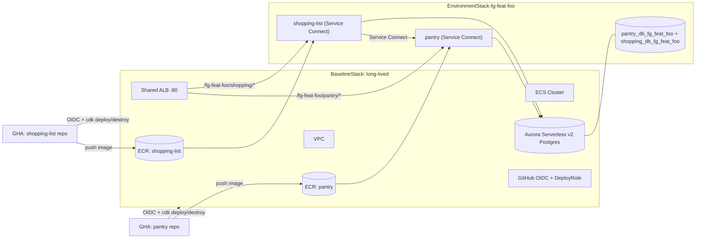

# infra — Preview Environments CDK App

The control plane for two FastAPI services ([`pantry`](https://github.com/your-org/pantry), [`shopping-list`](https://github.com/your-org/shopping-list)) and their ephemeral per-feature-branch preview environments on AWS. Python CDK, managed with `uv`.

Solves the "single shared dev environment" problem by spinning up isolated copies of the stack per feature branch, with cross-repo branch correlation so a "feature group" spanning both services gets a single combined env.

## Feature-group rule

The feature-group identifier is the **exact branch name**, across the two service repos.

- Branch on `pantry` only → `pantry-<branch>` env (pantry@branch + shopping-list@main).
- Branch on `shopping-list` only → `shopping-<branch>` env (pantry@main + shopping-list@branch).
- Same branch name on both → single `fg-<branch>` env (both services at branch).
- Different branch names on both → two independent solo envs (one per repo).
- Close one side of an `fg-...` env → demote to a solo env for the still-open side.
- Close both sides → destroy.

The full algorithm lives in [`scripts/reconcile.py`](scripts/reconcile.py).

## Stacks

- **`BaselineStack`** (long-lived, deployed once per region): VPC, Aurora Serverless v2 cluster, ECS cluster, shared ALB, ECR repos, GitHub OIDC provider + deploy role, and the `db_bootstrap` Lambda invoked by per-env stacks.
- **`EnvironmentStack-<envName>`** (one per preview env): per-env Cloud Map namespace for Service Connect, custom resource that creates the per-env logical databases on the shared Aurora cluster, Fargate services for `pantry` and `shopping-list`, target groups, and listener rules on the shared ALB at `/<envName>/pantry/*` and `/<envName>/shopping/*`.



## Local dev: full-stack demo (no AWS)

[`docker-compose.dev.yaml`](docker-compose.dev.yaml) runs both services + Postgres locally with hot reload. It expects the `pantry` and `shopping-list` repos checked out as siblings of this repo:

```plaintext
workspace/
  infra/           # this repo
  pantry/
  shopping-list/
```

Run from this directory:

```bash
docker compose -f docker-compose.dev.yaml up --build -d

curl http://localhost:8000/pantry/healthz
curl http://localhost:8001/shopping/healthz

# End-to-end purchase flow: shopping-list → pantry via the in-cluster client
curl -X POST http://localhost:8001/shopping/list \
  -H 'content-type: application/json' \
  -d '{"name":"Milk","category":"Dairy","quantity":2,"unit":"L"}'

curl -X POST http://localhost:8001/shopping/list/1/purchase
curl http://localhost:8000/pantry/items   # should now contain Milk
```

## CDK synth + deploy

```bash
uv sync
bash scripts/build-lambdas.sh             # vendor pg8000 into the Lambda bundle
npx -y aws-cdk synth                      # synth BaselineStack only
npx -y aws-cdk synth -c envName=demo \
  -c pantryImageTag=main -c shoppingImageTag=main   # also synth EnvironmentStack-demo
```

To deploy to real AWS (first time, from a workstation with admin creds):

```bash
npx -y aws-cdk bootstrap aws://<ACCOUNT_ID>/us-east-1
GITHUB_ORG=<your-org> npx -y aws-cdk deploy BaselineStack
```

After that, GitHub Actions assumes the OIDC role and handles all `EnvironmentStack-*` deploys.

### Context flags

| Flag | Purpose |
| --- | --- |
| `-c envName=...` | Also synth/deploy the per-env stack with this name |
| `-c pantryImageTag=...` | ECR image tag for pantry (default `main`) |
| `-c shoppingImageTag=...` | ECR image tag for shopping-list (default `main`) |
| `-c githubOrg=...` | GitHub org for the OIDC trust policy |
| `-c ministack=true` | Strip OIDC + custom resources + inter-SG ingress + RDS for Ministack |
| `-c dbHost=...` `-c dbPort=...` | Required with `ministack=true` for env stacks; supplied by `cdklocal-deploy.sh` |

## Reconcile script

[`scripts/reconcile.py`](scripts/reconcile.py) decides which CDK stacks to deploy/destroy for a given branch event. The GitHub Actions workflow in each service repo invokes it on `push` / `pull_request` events.

```bash
# Real-CI invocation: looks up the other repo's branch via the GitHub API
uv run python scripts/reconcile.py \
  --this-repo pantry --other-repo shopping-list \
  --branch feat/checkout \
  --event upsert \
  --this-image-tag $(git rev-parse HEAD)
```

For local exploration (no real repos required), use `--simulate-other-has-branch` and `--dry-run` to exercise all four state transitions:

```bash
# 1. Solo PR on pantry  →  deploy `pantry-feat-checkout` (pantry@abc123 + shopping@main)
uv run python scripts/reconcile.py \
  --this-repo pantry --other-repo shopping-list \
  --branch feat/checkout --event upsert --this-image-tag abc123 \
  --simulate-other-has-branch false --dry-run

# 2. Matching PR opens on shopping-list  →  PROMOTE: destroy solos, deploy `fg-feat-checkout`
uv run python scripts/reconcile.py \
  --this-repo shopping-list --other-repo pantry \
  --branch feat/checkout --event upsert --this-image-tag def456 \
  --simulate-other-has-branch true --simulate-other-sha abc123 --dry-run

# 3. Close pantry's PR while shopping-list's stays open  →  DEMOTE
uv run python scripts/reconcile.py \
  --this-repo pantry --other-repo shopping-list \
  --branch feat/checkout --event delete \
  --simulate-other-has-branch true --simulate-other-sha def456 --dry-run

# 4. Close shopping-list's PR  →  TEAR DOWN remaining envs
uv run python scripts/reconcile.py \
  --this-repo shopping-list --other-repo pantry \
  --branch feat/checkout --event delete \
  --simulate-other-has-branch false --dry-run
```

## Bootstrap scripts

[`scripts/bootstrap-dbs.py`](scripts/bootstrap-dbs.py) is the host-side replacement for the `db_bootstrap` Lambda in Ministack mode. It reads master Postgres credentials from Secrets Manager and creates/drops per-env logical databases:

```bash
uv run python scripts/bootstrap-dbs.py create --env-name fg-checkout
uv run python scripts/bootstrap-dbs.py drop   --env-name fg-checkout
```

[`scripts/ministack-create-db.py`](scripts/ministack-create-db.py) is the Ministack-only step that pre-creates the DB subnet group and a Postgres DB instance via the RDS API (Ministack's CFN engine doesn't provision `AWS::RDS::DBSubnetGroup`/`DBInstance`). It probes the resulting container for connection readiness before exiting and emits host- vs container-reachable endpoints.

## Ministack support (best-effort)

We chose [Ministack](https://ministack.org/) over LocalStack for local AWS emulation. The CDK code supports a `-c ministack=true` flag that strips/swaps constructs Ministack can't run:

- OIDC provider → `AccountRootPrincipal`-trust role
- `cr.Provider` DB bootstrap → host-side [`scripts/bootstrap-dbs.py`](scripts/bootstrap-dbs.py)
- Aurora cluster → host-side [`scripts/ministack-create-db.py`](scripts/ministack-create-db.py) (creates a Postgres DB instance via the RDS API)
- NAT gateways → public subnets + `assign_public_ip=true`
- inter-SG ingress → single shared SG with CIDR-only inline rules
- L2 target group / listener rule → L1 `CfnTargetGroup` / `CfnListenerRule` (avoids CDK's automatic SG-to-SG ingress)

Bring up the emulator (state persists in `./.ministack/`):

```bash
docker compose -f docker-compose.ministack.yaml up -d
bash scripts/ministack-up.sh                # push initial images
bash scripts/cdklocal-deploy.sh fg-demo     # deploys baseline, creates RDS+DBs, deploys env
```

**Verified on Ministack 1.3.37:** `BaselineStack` reaches `CREATE_COMPLETE` (~27 resources). `ministack-create-db.py` provisions Postgres and emits host (`localhost:<port>`) and container (`host.docker.internal:<port>`) endpoints. `bootstrap-dbs.py` creates per-env logical DBs.

**Known limitation:** `EnvironmentStack` deploy fails on Ministack 1.3.37 with `Unsupported resource type: AWS::ElasticLoadBalancingV2::TargetGroup`. Bridging that would mean further out-of-band scripts (`elbv2.create_target_group` + `create_rule`) and attaching the ECS service to externally-managed ARNs — at which point the CDK code stops being the source of truth. For a running-services demo, use `docker-compose.dev.yaml`.

## GitHub configuration

Three repos, three secret/var scopes. `AWS_DEPLOY_ROLE` is the role ARN exported by `BaselineStack` as `GhaDeployRoleArn`.

### `infra` repo

| Name | Type | Purpose |
| --- | --- | --- |
| `AWS_DEPLOY_ROLE` | variable | Same role ARN used by both service repos |

### `pantry` and `shopping-list` repos

| Name | Type | Purpose |
| --- | --- | --- |
| `AWS_DEPLOY_ROLE` | variable | ARN of `GhaDeployRole` from `BaselineStack` outputs |
| `INFRA_REPO_TOKEN` | secret | Token with `contents: read` on the `infra` repo (PAT or GitHub App) |
| `CROSS_REPO_READ_TOKEN` | secret | Token with `contents: read` on the *other* service repo |
| `INFRA_REPO` | variable | e.g. `your-org/infra` |

If you have a GitHub org, promote `AWS_DEPLOY_ROLE` and `INFRA_REPO` to org-level. The two read tokens are ideal candidates for a single GitHub App installed on all three repos.

### Pre-flight checklist before pushing your first feature branch

1. `npx aws-cdk bootstrap aws://<account>/<region>` once per account+region.
2. From a workstation with admin creds, deploy `BaselineStack` once manually: `GITHUB_ORG=<your-org> npx aws-cdk deploy BaselineStack`. This creates the OIDC provider and `GhaDeployRole`.
3. Copy the `GhaDeployRoleArn` output and set it as `AWS_DEPLOY_ROLE` in all three repos (or at the org level).
4. Set the remaining secrets/vars as above.
5. Push to `main` in each service repo to seed the `:main` image tags in ECR (the reconciler uses these as the "stable" tag for the non-feature side of a solo env).
6. Push a feature branch and open a PR. `preview.yml` runs the reconciler.

## What's intentionally not implemented

- Auth (Cognito + ALB authorizer).
- Alembic migrations (using `Base.metadata.create_all` on startup).
- Async SQLAlchemy.
- HTTPS / ACM on the ALB.
- Per-env subdomains (we chose path-prefix on the shared ALB).
- Seeding per-env databases from `main` (`pg_dump | pg_restore` hook in the bootstrap Lambda is an easy add).
- A DynamoDB env-registry (CloudFormation stack listing is the source of truth).
- Tests beyond `/healthz` smoke checks.
